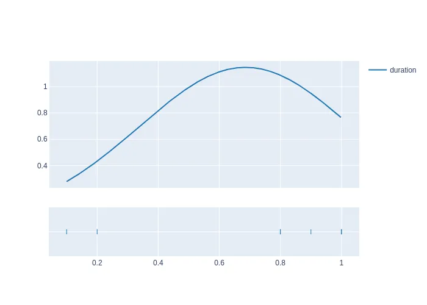

# Python graphing with Plotly

Reference: https://plotly.com/python-api-reference/

Gantt References via Timeline https://plotly.com/python-api-reference/generated/plotly.express.timeline.html

Scatter https://plotly.com/python-api-reference/generated/plotly.express.scatter.html

histogram: https://plotly.com/python-api-reference/generated/plotly.figure_factory.create_distplot.html

## HOWTO install requirements

```bash
pip3 install -r requirements.txt
```

## Sample image render
Sample Gantt for plotting concurrency


Sample Scatter for plotting average


Sample normalised histogram
